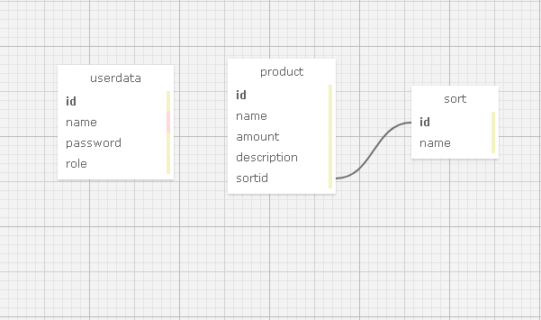

## Описание проекта
### Приложение CRUD содержит чисто backend часть. Оно обрабатывает rest запрос и выдаёт json ответ, содержащий данные, хранящиеся в таблица базы Postgresql
## Старт приложения
### Для проверки приложения нужно стартовать его, затем перейти по ссылке. Входные парамтры соответствуют json запросу 
#### Авторизация админа - http://localhost:8100/autorization?name=Максим&password=123
#### Авторизация пользователя - http://localhost:8100/autorization?name=Дима&password=123
#### Получить json таблицы на странице админа - http://localhost:8100/admin/getTables
#### Получить json таблицы на странице пользователя - http://localhost:8100/page/getTables
#### Добавить пользователя (Пример) - http://localhost:8100/admin/createUser?name=Вадим&password=8888&role=user
#### Удалить пользователя (Пример) - http://localhost:8100/admin/deleteUser?name=Вадим
#### Добавить сорт (Пример) - http://localhost:8100/admin/createSort?id=100&name=Комьютерная техника
#### Удалить сорт (Примет) - http://localhost:8100/admin/deleteSort?name=КомьютернаяТехника
#### Добавить продукт (Пример) - http://localhost:8100/admin/createProduct?name=Ноутбук&amount=3&description=Lenovo&sortid=100
#### Удалить продукт (Пример) - http://localhost:8100/admin/deleteProduct?name=Ноутбук
## 12.09.2021
### При запуске приложения, Spring автоматически создаёт таблицы, если указать в application.properties:
#### spring.datasource.initialization-mode=ALWAYS
#### spring.datasource.schema=classpath*:static/CreateTables.sql
### Где CreateTables.sql файл содержащий 3 таблицы в виде query кода postresql.

### Добавленнные классы:
#### User - DAO класс
#### UserRepository - класс подключающий DAO конструкцию к Jparepository
#### Также в нём можно создавать свои query запросы
#### В UserRepository я создал запросы для нахождения записи по имени и удаления по имени в частности и дополнительно создал в каждом экземпляре репозитория запрос на обнуление счётчика айди, так как он инкрементировался каждый раз после добавления и удаления всех записей независимо от содержащейся в базе информации. Но в таблице sort имеющей ключ от которого зависит поле sortid таблицы product создать обнуление счётчика не удалось
#### Поэтому при каждой новой записи в таблицу sort счётчик последнего айди нужно обновлять вручную
#### UserService - класс сервис, реализующий базовые методы для получения всех записей и удаления всех записей
#### MainController - класс-контроллер реагирующий на http запросы. Содержит бин проверяющий поcледний айди записей в каждой таблице. @GetMapping тестирует код написанный в JUnitTestUserTable и одноимённых классах
### Результаты тестов отображаются в консоли после открытия страницы в интернете на localhost
## 19.09.2021
### Внесённые изменения
#### Разбросал классы по пакетам. В MainController добавил аннотацию @ComponentScan для подключения пакета юнит тестов
#### Пакеты с DAO, сервисами и JPA - репозиториями подключил, потому что Spring требовал путь к сервису для MainController
#### Затем он не мог найти JPA(репозитории) добавил аннотацию @EnableAutoConfiguration в сервисы и заработало
#### Вместо query команд использовал liquibase синтаксис в yaml файле db.changelog/db.changelog-master.yaml и, соответственно, добавил настройки в properties
## 30.09.2021
### Внесённые изменения
#### Изменил RestController на контроллер для отображения ресурсов html. Логику работы Security Get обработчиков перенёс в 4 отдельных класса пакета security.
#### Liquibase конфигурацию переделал. Нужно было объявлять уникальные значения полей после записи о создании таблицы иначе не работает уникальность полей имени и названий
#### Для теста нужно открыть localhost, потом в консоли ввести имя и пароль( Добавил 2 пользователя: Максим, 123, admin; Дима, 123, user). Админу доступны ресурсы /admin и /page, а пользователю только /page.
#### Если пользователь не зарегистрирован или куки недействительны его перебросит на /autorization с любого ресурса.
#### Куки может быть недействителен при перезагрузке сервера или подделке.
#### Всего ресурсов 4: /, /autorization, /page, /admin.
## 2.10.2021
### Внесенные изменения
#### Поменял обратно Controller на RestController для совместимости с json форматом и большей нагялядности работы CRUD
#### Ресурсы остались теми же, но ответ от сервера тепереь - это строки или json
#### Раскидал по классам всю логику, зарефакторил, создал javadoc для интерфейсов сервисов.
#### Форму запроса url подписал над каждым методом обработки запроса
## 06.10.2021
### Внесённые изменения:
#### - рефакторинг выявленных недостатков структуры проекта